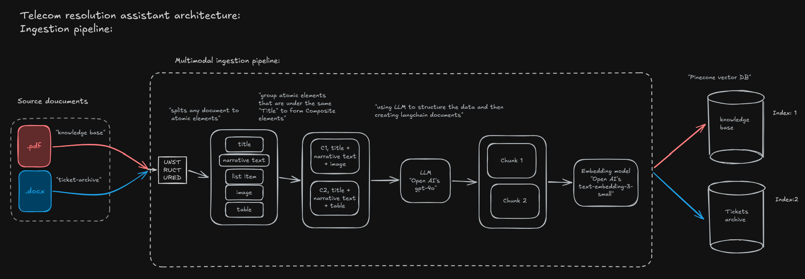
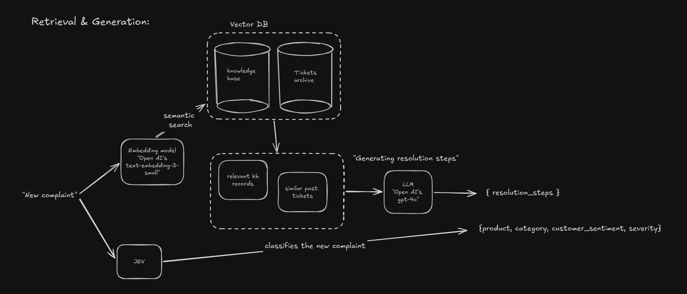

# AsterLink Resolution Assistant

**Prodapt Use Case 2 submission by Yashwant J (23110461)**

AsterLink Resolution Assistant is a production-oriented telecom support assistant that helps support agents classify customer complaints, retrieve relevant historical tickets and knowledge-base articles, and generate grounded resolution steps.

## 1. Problem Statement

AsterLink support agents currently rely on keyword-based search to find relevant knowledge-base articles and previously resolved tickets. This approach can miss useful records when customers describe the same issue using different words, forcing agents to spend more time searching and manually combining information before deciding on a resolution.

The challenge is to build a production-grade semantic resolution assistant that can take a raw customer complaint, understand its key attributes such as product, category, severity, and sentiment, retrieve the most relevant historical tickets and knowledge-base articles using semantic search, and help the agent arrive at a grounded resolution. The system must also remain useful as new tickets, knowledge-base content, and support categories evolve.

## 2. Solution

AsterLink Resolution Assistant replaces keyword-only lookup with a semantic, AI-assisted resolution workflow. A raw customer complaint is first classified using JEV into structured attributes such as product, category, severity, and customer sentiment. The complaint is then embedded and searched against separate Pinecone indexes containing AsterLink's knowledge base and resolved ticket history.

The most relevant evidence is passed to GPT-4o, which generates concise, step-by-step resolution guidance using only the retrieved sources. Knowledge-base articles act as the primary source of truth, while historical tickets provide supporting examples from similar cases. The generated response is grounded in retrieved evidence and designed to include source references, helping agents reach resolutions faster while keeping the final decision with the support agent. The example below shows the end-to-end flow for a new customer complaint.

## 3. System Architecture

### Ingestion Pipeline

### Retrieval & Generation Pipeline

## 4. Explorations & Design Decisions

The system was designed as more than a working RAG prototype. Each major choice was made with retrieval quality, maintainability, cost, and the ability to handle growing support data in mind.

### 1. Structure-aware chunking for real support documents
Explored multiple chunking strategies and chose Unstructured's `by_title` strategy for PDF and DOCX files. Instead of splitting documents at arbitrary character boundaries, related titles, paragraphs, lists, tables, and images are kept together as meaningful sections.

**Why it matters:** This preserves document context and makes the ingestion pipeline better suited to real-world support knowledge bases.

### 2. Multimodal document ingestion
Knowledge-base documents are first partitioned into structured elements using Unstructured before being converted into LangChain documents.

**Why it matters:** Real support documentation is rarely plain text. Designing around mixed PDF/DOCX content makes the ingestion pipeline more representative of a production environment.

### 3. Searchable content vs metadata
I deliberately separated the text used for similarity search from supporting metadata. For historical tickets, the complaint is stored as `page_content`, while resolution steps, ticket IDs, filenames, and other operational fields remain in metadata.

**Why it matters:** Resolution text and identifiers do not and should not distort similarity scores, while the same information remains available for generation, filtering, and traceability.

### 4. Separate indexes for knowledge bases and resolved tickets
Knowledge-base articles and historical tickets are stored in separate Pinecone indexes because they serve different purposes.

**Why it matters:** Knowledge-base articles remain the primary source of truth, while historical tickets provide supporting examples. Separate indexes also allow each corpus to be retrieved and scaled independently.

### 5. Production-oriented vector storage and record lifecycle
The initial local Chroma baseline was migrated to Pinecone. Records use stable identifiers so they can be updated or deleted without rebuilding the entire vector store.

**Why it matters:** Support data changes continuously. Incremental upserts and deterministic record IDs make the system easier to maintain as new tickets and revised knowledge-base content are introduced.

### 6. Task-specific models
I use TypeSafe's Jev System One model for structured complaint classification and GPT-4o for grounded resolution generation.

**Why it matters:** Classification needs constrained, machine-readable decisions, while resolution generation requires stronger language reasoning over retrieved evidence. Using each model for the task it is best suited for keeps the pipeline more predictable and efficient.