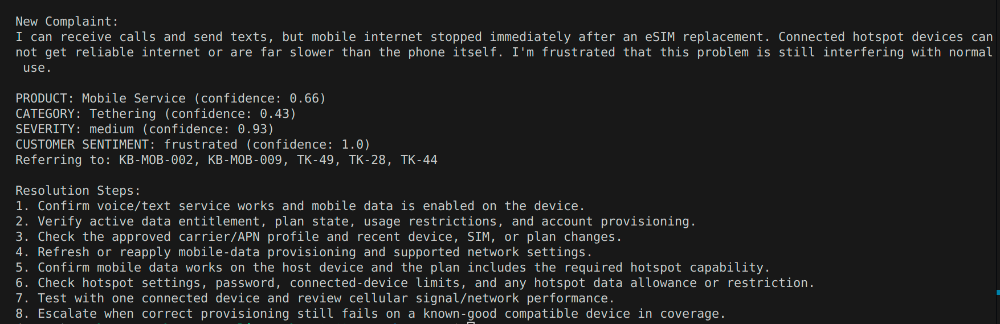
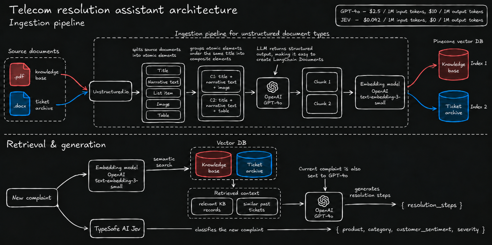
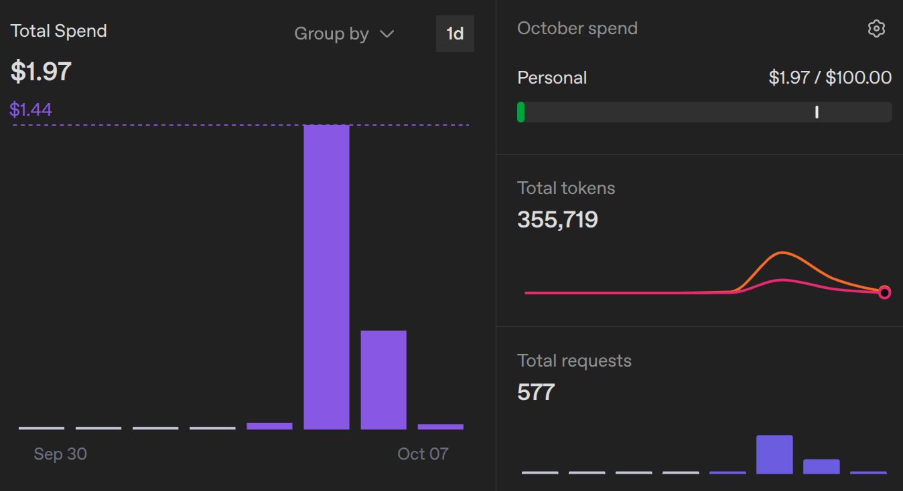
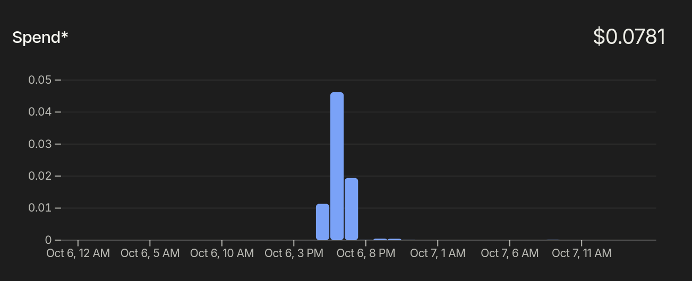

# AsterLink Resolution Assistant

**Prodapt Use Case 2 submission by Yashwant J (23110461)**

AsterLink Resolution Assistant is a production-oriented telecom support assistant that helps support agents classify customer complaints, retrieve relevant historical tickets and knowledge-base articles, and generate grounded resolution steps.

## Table of Contents

## Table of Contents

1. [Problem & Use Case](#1-problem--use-case)
2. [Solution Overview](#2-solution-overview)
3. [Tech Stack](#3-tech-stack)
4. [System Architecture](#4-system-architecture)
5. [Engineering Explorations & Design Decisions](#5-engineering-explorations--design-decisions)
6. [Evaluation & Results](#6-evaluation--results)
7. [System Health, Reliability & Cost](#7-system-health-reliability--cost)
8. [Engineering Notes & RAG Exploration](#8-engineering-notes)

## 1. Problem & Use Case

AsterLink support agents currently rely on keyword-based search to find relevant knowledge-base articles and previously resolved tickets. This approach can miss useful records when customers describe the same issue using different words, forcing agents to spend more time searching and manually combining information before deciding on a resolution.

The challenge is to build a production-grade semantic resolution assistant that can take a raw customer complaint, understand its key attributes such as product, category, severity, and sentiment, retrieve the most relevant historical tickets and knowledge-base articles using semantic search, and help the agent arrive at a grounded resolution. The system must also remain useful as new tickets, knowledge-base content, and support categories evolve.

## 2. Solution Overview

AsterLink Resolution Assistant replaces keyword-only lookup with a semantic, AI-assisted resolution workflow. A raw customer complaint is first classified using Jev into structured attributes such as product, category, severity, and customer sentiment. The complaint is then embedded and searched against separate Pinecone indexes containing AsterLink's knowledge base and resolved ticket history.

The most relevant evidence is passed to GPT-4o, which generates concise, step-by-step resolution guidance using only the retrieved sources. Knowledge-base articles act as the primary source of truth, while historical tickets provide supporting examples from similar cases. The generated response is grounded in retrieved evidence and designed to include source references, helping agents reach resolutions faster while keeping the final decision with the support agent. The example below shows the end-to-end flow for a new customer complaint.

### Interactive Terminal UI

AsterLink also includes an interactive terminal interface for working with the assistant and managing the retrieval corpus without editing application code directly.

The terminal currently supports:

- **Look Up** - enter a customer complaint and run the support workflow to classify the issue, retrieve relevant knowledge-base articles and historical tickets, and generate grounded resolution steps.
- **Upsert** - add or update source records in Pinecone. Knowledge-base PDFs and resolved-ticket DOCX archives are parsed through the existing ingestion pipeline before their records are upserted into the appropriate index.
- **Delete** - remove records from the vector store. Knowledge-base deletion uses the selected source file together with the KB ID to identify the stored record, while ticket deletion uses the ticket ID.

This interface provides a simple operator-facing way to test the assistant and exercise the record lifecycle implemented by the ingestion and vector-store layers.

## 3. Tech Stack

| Component | Technology |
| --- | --- |
| Language | Python |
| RAG Framework | LangChain |
| Vector Database | Pinecone |
| Embeddings | OpenAI - text-embedding-3-small |
| Resolution Generation | OpenAI - GPT-4o |
| Complaint Classification | TypeSafe AI - JEV System One |
| Document Processing | Unstructured |

## 4. System Architecture

## 5. Engineering Explorations & Design Decisions

The system was designed as more than a working RAG prototype. Each major choice was made with retrieval quality, maintainability, cost, and the ability to handle growing support data in mind.

### 1. Structure-aware chunking for real support documents
Explored multiple chunking strategies and chose Unstructured's `by_title` strategy for PDF and DOCX files. Instead of splitting documents at arbitrary character boundaries, related titles, paragraphs, lists, tables, and images are kept together as meaningful sections.

**Why it matters:** This preserves document context and makes the ingestion pipeline better suited to real-world support knowledge bases.

### 2. Multi-format document ingestion

The ingestion pipeline supports both PDF knowledge-base documents and DOCX historical ticket archives, using Unstructured to partition them into structured elements before converting them into LangChain documents.

**Why it matters:** Real support documentation is rarely plain text. Designing around mixed PDF/DOCX content makes the ingestion pipeline more representative of a production environment.

### 3. Searchable content vs metadata
I deliberately separated the text used for similarity search from supporting metadata. For historical tickets, the complaint is stored as `page_content`, while resolution steps, ticket IDs, filenames, and other operational fields remain in metadata.

**Why it matters:** Resolution text and identifiers should not distort similarity scores, while the same information remains available for generation, filtering, and traceability.

### 4. Separate indexes for knowledge bases and resolved tickets
Knowledge-base articles and historical tickets are stored in separate Pinecone indexes because they serve different purposes.

**Why it matters:** Knowledge-base articles remain the primary source of truth, while historical tickets provide supporting examples. Separate indexes also allow each corpus to be retrieved and scaled independently.

### 5. Production-oriented vector storage and record lifecycle
The initial local Chroma baseline was migrated to Pinecone. Records use stable identifiers so they can be updated or deleted without rebuilding the entire vector store.

**Why it matters:** Support data changes continuously. Incremental upserts and deterministic record IDs make the system easier to maintain as new tickets and revised knowledge-base content are introduced.

### 6. Task-specific models
I use TypeSafe's Jev System One model for structured complaint classification and GPT-4o for grounded resolution generation.

**Why it matters:** Classification needs constrained, machine-readable decisions, while resolution generation requires stronger language reasoning over retrieved evidence. Using each model for the task it is best suited for keeps the pipeline more predictable and efficient.

## 6. Evaluation & Results

The system is evaluated at three separate stages-classification, retrieval, and generation-using both the development and held-out test tickets. Evaluating each stage independently makes it easier to identify whether failures come from classification, retrieval, or generation rather than relying only on an end-to-end score.

### Classification

Complaint classification was evaluated on both the development set and a separate held-out test set. Each ticket contains four labels: product, category, severity, and customer sentiment.

| Dataset | Correct Predictions | Accuracy |
| --- | ---: | ---: |
| Held-out set | 74 / 80 | **92.5%** |
| Development set | 72 / 80 | **90.0%** |

The small gap between development and held-out performance indicates that the classification rules generalize reasonably well beyond the examples used during iteration.

### Retrieval

Knowledge-base and historical-ticket retrieval were evaluated using **Recall@K, Precision@K, MRR, and NDCG@K**. Recall is especially important for this use case because missing the relevant support evidence is generally more costly than retrieving an additional candidate.

#### Historical Ticket Retrieval

| K | Recall@K | Precision@K | MRR | NDCG@K |
| ---: | ---: | ---: | ---: | ---: |
| 3 | 0.7917 | 0.7667 | **1.0000** | 0.8309 |
| 4 | 0.8750 | 0.7500 | **1.0000** | 0.8775 |
| 5 | **0.9250** | 0.4700 | **1.0000** | **0.9047** |

#### Knowledge-Base Retrieval

| K | Recall@K | Precision@K | MRR | NDCG@K |
| ---: | ---: | ---: | ---: | ---: |
| 3 | 0.9500 | 0.5000 | 0.9500 | 0.9124 |
| 4 | 0.9750 | 0.3875 | 0.9500 | 0.9256 |
| 5 | **1.0000** | 0.3200 | 0.9500 | **0.9374** |

As expected, increasing `K` improves recall but lowers precision. This is partly because most evaluation tickets are linked to only one or two relevant knowledge-base articles or similar historical tickets, so retrieving additional results at higher `K` naturally introduces more non-relevant candidates. In production, this creates a practical trade-off between maximizing recall and controlling prompt size, latency, and generation noise.

### Generation

Generation quality was evaluated using Jev as a structured judge across the two development and held-out test ticket sets.

| Evaluation Method | Decision Type | Result |
| --- | --- | ---: |
| Jev-as-a-Judge | Yes / No | **85% average confidence** |

Jev evaluates whether the generated resolution is semantically aligned with the actual resolution steps using a constrained **Yes/No** decision. The average confidence score for positive judgements was approximately **85%**, providing a structured measure of generation quality across the evaluation set.

## 7. System Health, Reliability & Cost
### Latency

Latency was measured independently around classification, retrieval, and generation using `time.perf_counter()`.

| Stage | Run 1 | Run 2 | Run 3 |
| --- | ---: | ---: | ---: |
| Classification | **0.51 s** | **0.65 s** | **0.78 s** |
| Retrieval | **7.41 s** | **7.69 s** | **8.04 s** |
| Generation | **1.84 s** | **2.27 s** | **2.54 s** |
| End-to-end | **9.76 s** | **11.05 s** | **11.36 s** |

The measurements consistently show retrieval as the largest contributor to end-to-end latency. Each complaint is searched against both the knowledge-base and historical-ticket vector indexes, making retrieval the primary optimization target. Classification remains less than a second, while grounded generation takes roughly 2-3 seconds.

### Cost

API usage was also monitored during development to understand the cost of both online inference and offline ingestion.

| Operation | Observed Cost |
| --- | ---: |
| Generate one grounded resolution with GPT-4o | ~**$0.002** |
| Ingest 50 historical tickets | ~**$0.20** |
| Process and ingest a ~10-page knowledge-base PDF | ~**$0.35** |
| OpenAI embedding generation | ~**$0.001** |
| Jev classification | < ~**$0.0001** |

Jev is particularly inexpensive for the classification stage because it is designed for structured decisions rather than text generation.

Based on the API dashboards used during development, approximately **$1.97** was spent on OpenAI services and **$0.078** on Jev, giving an observed project API spend of roughly **$2.05**.

#### OpenAI

#### TypeSafe AI / Jev

Costs shown above are measurements from this project rather than fixed estimates.

### Reliability

**Observed Reliability:** The pipeline remained stable during continuous use. After extended periods of inactivity, occasional transient connection failures were observed on the first request to external services such as Pinecone and TypeSafe AI. Subsequent requests completed normally, behaviour consistent with a transient cold-start or connection-establishment issue rather than a persistent pipeline failure.

## 8. Engineering Notes

Handwritten exploration notes covering chunking strategies, semantic retrieval, multimodal RAG, hybrid search, MMR, RRF, and multi-query retrieval are available in [`notes`](./notes.pdf).